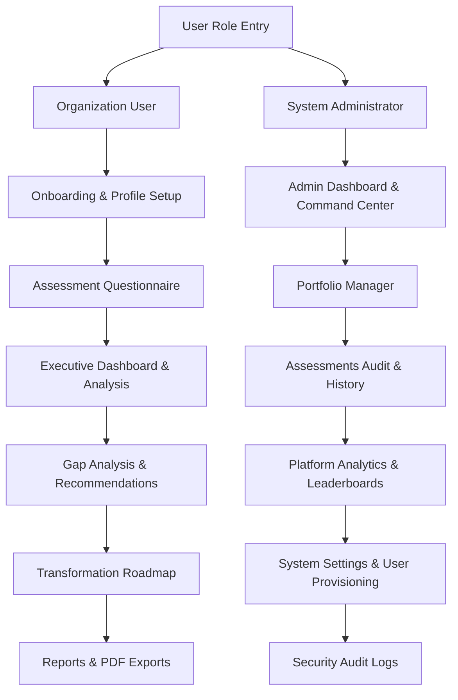
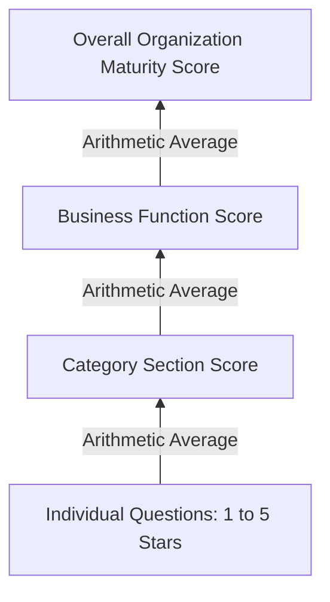

# Maturity IQ Platform Manual
> **Confidential Strategy & Operations Document**  
> **Target Audience:** Clients, Business Owners, Managers, Investors, Testers, and New Team Members  
> **Version:** 1.0.0 (Enterprise Edition)

---

## 1. Executive Summary

**Maturity IQ** is a SaaS-based Organizational Maturity Assessment platform designed to evaluate, benchmark, and guide enterprise-level capabilities across critical business functions. The platform enables organizations to perform rigorous self-audits, visualize capability scores, identify operational gaps, receive targeted improvement recommendations, and establish collaborative execution roadmaps.

By translating complex organizational processes into quantitative scores, Maturity IQ empowers executives, board members, and steering committees to:
- Establish a verified baseline of current capabilities.
- Compare department performance against industry benchmarks.
- Strategize transformation efforts through automatically compiled, high-impact recommendations.
- Manage tactical rollout plans in an integrated roadmap system.

---

## 2. Key Concepts & Definitions

To understand Maturity IQ, stakeholders should be familiar with the following core entities and concepts:

| Concept | Description |
| :--- | :--- |
| **Organization (Workspace)** | An isolated corporate entity (e.g., *Emaar Properties*, *Cleveland Clinic*) with custom parameters (revenue, staff size, type) and an evidence document vault. |
| **Business Function (Department)** | The scope areas of evaluation. The platform supports up to 8 functions: *Strategy, Human Resources (HR), Innovation, Information Technology (IT), Legal & Compliance, Risk Management, Operations, and Project Management*. |
| **Category Section** | Sub-divisions within each business function (e.g., *Governance*, *Execution*, *Audit Trail*, *Tools & Tech*) that organize specific assessment parameters. |
| **Evaluation Parameter** | The specific questionnaire prompts that evaluate capabilities on a scale of 1 to 5. The platform supports multiple input types: Ratings, Yes/No, Single Select, and Multi-Select checkboxes. |
| **Maturity Level** | The classification of an organization's maturity based on its calculated scores. Ranges from **Initial (ad-hoc)** to **Optimized (continuous refinement)**. |
| **Target Maturity Threshold** | A customizable maturity benchmark (default **4.2**) representing the target state for gap analysis. |
| **Strategic Recommendation** | Actionable initiatives generated from assessment scores, detailing the priority, expected business impact, implementation timeline, and owner. |
| **Transformation Roadmap** | A tracking system for strategic initiatives using Kanban boards, timeline lists, or quarterly rollout calendars. |

---

## 3. Core Capabilities & User Journeys

The platform serves two primary user roles, each with a dedicated user interface and workflow:
1. **Organization User (Strategy Officer / Department Head)**: Responsible for conducting assessments, reviewing dashboards, managing evidence, and executing transformation roadmaps.
2. **System Administrator (Global Admin)**: Responsible for monitoring cross-sector statistics, auditing security logs, provisioning users, managing organizational portfolios, and updating industry templates.

---

## 4. Detailed Module Walkthroughs

### 4.1. Onboarding & Registration Wizard
When a new organization registers, they are guided through a **7-step wizard** that establishes their workspace and computes an immediate capability baseline:
1. **Account Registration**: Create login credentials (full name, email, password).
2. **Organization Profiling**: Provide firmographic details:
   - Organization Name (e.g., *Emaar Properties*).
   - Industry Sector (e.g., *Real Estate, Healthcare, Government, Education, Technology*).
   - Country (e.g., *UAE, Saudi Arabia*).
   - Staff Size (e.g., *1,200 employees*).
   - Annual Revenue (e.g., *$250M*).
   - Entity Type (*Private, Public Enterprise, Government, Family Office*).
3. **Business Function Selection**: Select which functional departments are in scope for evaluation.
4. **Baseline Assessment (Self-Audit)**: Answer initial questions across the selected functions.
5. **Evidence Upload**: Upload mock audit documents to back up self-assessed scores.
6. **Executive Summary Commenting**: Add contextual notes and operational observations.
7. **Verification & Setup**: Submit the baseline details, which instantiates the organization workspace and initializes the dashboards.

---

### 4.2. Corporate Dashboard
The primary landing page for an organization user is the **Executive Dashboard**, which provides a high-fidelity diagnostic visualization:
- **KPI Metrics**: Overall Maturity Score (e.g., *3.48 / Defined*), Assessment Progress %, Business Functions Assessed, High Risk Areas (scores < 2.5), and Pending Review actions.
- **Maturity Distribution**: A pie chart showing the proportion of business functions at each maturity tier.
- **Sector Benchmarks**: A comparative line chart plotting the organization's scores against industry averages.
- **radar/Capability Map**: A spider chart mapping scores across all evaluated departments.
- **Recent Recommendations**: A list of key initiatives generated by the scoring engine.

---

### 4.3. Business Function Explorer
Allows stakeholders to drill down into any department to analyze specific capabilities:
- **Function Scorecard**: Displays the individual score (e.g., *HR: 3.20*) and corresponding maturity classification.
- **Strengths & Weaknesses**: Auto-identifies the top-performing categories and the weakest categories requiring immediate attention.
- **Visual Analytics**: Interactive bar charts and radar charts graphing scores for category sections.
- **Section Heat Map**: An interactive matrix displaying every individual question score (color-coded from light green/yellow to dark green based on strength) to locate the exact parameters dragging down performance.

---

### 4.4. Gap Analysis Console
A consulting-oriented tool comparing current performance against a target threshold:
- **Aggregate Gap Size**: Sum of all capability deltas across business functions.
- **Target Line (4.2)**: A vertical marker highlighting the gap between actual ratings and the desired state.
- **Priority Classifications**: Delta values auto-assign urgency tags:
  - **Critical**: Score gap > 2.0.
  - **High**: Score gap between 1.5 and 2.0.
  - **Medium**: Score gap between 0.8 and 1.5.
  - **Low**: Score gap < 0.8.

---

### 4.5. AI-Powered Recommendations Engine
Generates prioritized improvement plans based on low scoring areas. Features:
- **Prioritization Cards**: Categorized into *Critical, High, Medium, and Low* priority.
- **Action Attributes**: Specifies the exact title, description of the initiative, estimated business impact (e.g., *High Impact*), execution timeline (e.g., *3-6 months*), and responsible function.
- **Regenerate System**: An on-demand compiler that recalculates recommendations when assessment responses are updated.

---

### 4.6. Transformation Roadmap
Allows project managers and strategy teams to organize recommendations into a rollout schedule. Includes three interactive views:
- **Kanban Board**: Drag-and-drop-style board organizing initiatives into four statuses: *Not Started, In Progress, On Hold, and Completed*.
- **Timeline Table**: A tracking list displaying initiatives with owner assignments, timelines, quarters, and quick increment controls (`+` / `-` progress % buttons).
- **Quarterly Calendar**: Displays initiatives grouped by target quarters (*Q1 2026* through *Q4 2026*) for long-term strategic scheduling.
- **Initiative Builder**: A modal form to manually input custom initiatives, assign owners, set target quarters, define priorities, and establish baseline progress.

---

### 4.7. Reports Console
A center for compiling board-ready publication materials:
- **Report Templates**:
  - *Executive Summary*: A board-ready overview of results and strategic imperatives.
  - *Business Function Scorecard*: Granular section-level scorecards.
  - *Gap Analysis Report*: Visual breakdown of capability gaps.
  - *Recommendations Report*: List of action items with effort/impact calculations.
  - *Transformation Roadmap*: Strategic calendar details.
- **Exporting Options**: Download single or combined reports in publication-quality PDF format or structured Excel files.

---

## 5. Scoring & Business Logic Rules

The platform calculates capability metrics using a bottom-up mathematical aggregation:

### 5.1. Scoring Calculations
1. **Section Score**:
   $$\text{Section Score} = \frac{\sum \text{Answered Question Scores}}{\text{Number of Answered Questions}}$$
   *(Unanswered parameters are excluded from the calculation to prevent skewing incomplete drafts).*

2. **Business Function Score**:
   $$\text{Business Function Score} = \frac{\sum \text{Active Section Scores}}{\text{Number of Active Sections}}$$

3. **Overall Maturity Score**:
   $$\text{Overall Maturity Score} = \frac{\sum \text{Active Business Function Scores}}{\text{Number of Active Business Functions}}$$

4. **Department Completion %**:
   $$\text{Completion \%} = \left( \frac{\text{Total Answered Questions}}{\text{Total Questions in Department}} \right) \times 100$$

### 5.2. Maturity Classification Thresholds
Based on the overall maturity score, the platform assigns one of the following classification bands:

- **Initial (0.00 to 1.49)**: Ad-hoc, unstructured processes with high dependency on individual heroics.
- **Developing (1.50 to 2.49)**: Processes are partially documented; basic repeatability is established.
- **Defined (2.50 to 3.49)**: Standard operating models are formalized, documented, and communication flows are standardized.
- **Managed (3.50 to 4.49)**: Processes are tracked with key performance metrics and managed quantitatively.
- **Optimized (4.50 to 5.00)**: Capabilities are continuously optimized and refined through feedback and technological innovation.
